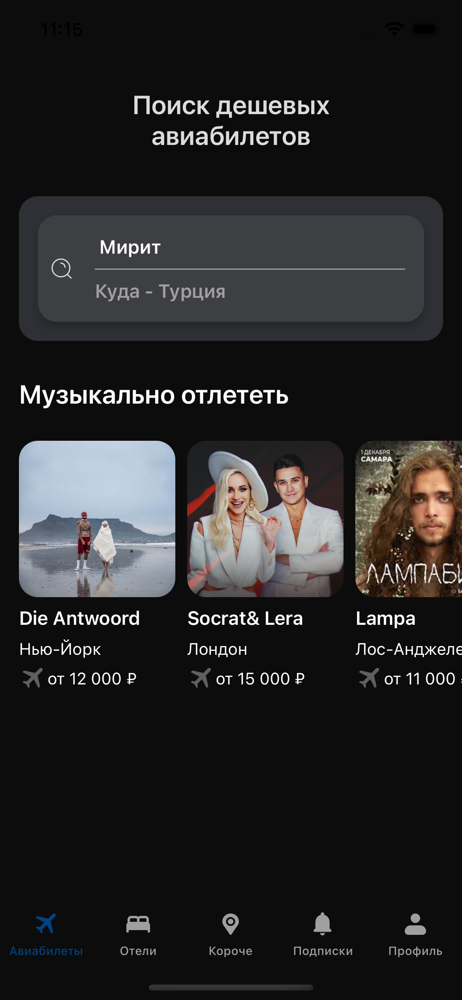
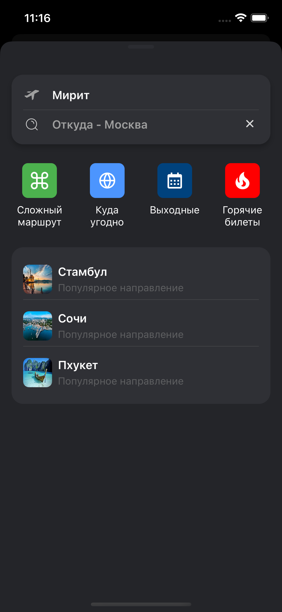
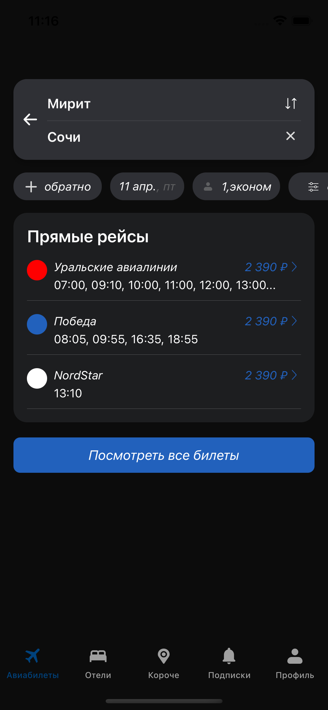

# AviaTicketsApp 

**AviaTicketsApp** — это мобильное приложение для поиска авиабилетов, разработанное на Swift с использованием UIKit. Весь интерфейс создан программно без использования Storyboard.

## 📲 Основные функции

- **Поиск авиабилетов**: возможность искать рейсы из пункта вылета в пункт прилета.
- **Менять города поиска местами**: возможность поменять местами города вылета и прилета одной кнопкой.
- **Предлагает город вылета**: запоменает последний город из которого совершался поиск.

## 🛠 Используемые технологии

- **Язык программирования**: Swift
- **Фреймворк**: UIKit
- **Архитектура**: MVVM + Coordinator
- **Управление зависимостями**: CocoaPods
- **Сетевые запросы**: URLSession + Combine
- **Локализация**: Localizable.strings
- **Интерфейс**: Программно
- **Другое**: SwiftGen, SnapKit, UserDefaults

## 📱 Интерфейс

Ниже представлены ключевые экраны приложения:

<h3>🏁 Начальный экран с подборкой концертов</h3>


<hr/>

<h3>🔍 Экран поиска направления</h3>


<hr/>

<h3>🧭 Предложения по маршрутам</h3>


<hr/>

<h3>🗂 Stub-экран “Контент в разработке”</h3>


## 🚀 Установка и запуск

1. **Клонируйте репозиторий**:

   ```bash
   git clone https://github.com/KristelWhite/AviaTicketsApp.git
   ```

2. **Перейдите в директорию проекта**:

   ```bash
   cd AviaTicketsApp
   ```

3. **Установите зависимости**:

   ```bash
   pod install
   ```

4. **Откройте проект в Xcode**:

   Откройте файл `AviaTicketsApp.xcworkspace` в Xcode.


## 🔗 Дополнительные материалы

- 🎨 [Макет Figma](https://www.figma.com/file/u59qhHjKOpI2GmKuDRZBf8/Effective-Mobile.-%D0%A2%D0%B5%D1%81%D1%82%D0%BE%D0%B2%D0%BE%D0%B5-%D0%B7%D0%B0%D0%B4%D0%B0%D0%BD%D0%B8%D0%B5-%D0%B4%D0%BB%D1%8F-%D1%80%D0%B0%D0%B7%D1%80%D0%B0%D0%B1%D0%BE%D1%82%D1%87%D0%B8%D0%BA%D0%BE%D0%B2.-%D0%9F%D1%80%D0%BE%D0%B4%D0%B0%D0%B6%D0%B0-%D0%B0%D0%B2%D0%B8%D0%B0%D0%B1%D0%B8%D0%BB%D0%B5%D1%82%D0%BE%D0%B2?type=design&node-id=1-7&mode=design&t=Yd4mLgd2ubiVJ1Hc-0)

- 📄 JSON API (используются для отображения различных экранов):
  - [Главная. Первый вход](https://run.mocky.io/v3/ad9a46ba-276c-4a81-88a6-c068e51cce3a)
  - [Поиск. Выбрана страна](https://run.mocky.io/v3/38b5205d-1a3d-4c2f-9d77-2f9d1ef01a4a)
  - [Посмотреть все билеты](https://run.mocky.io/v3/c0464573-5a13-45c9-89f8-717436748b69)
 
- [📄 ТЗ на разработку приложения для поиска билетов](https://docs.google.com/document/d/1LoeEYX8CXFiM684sAbZNTiUF0-QgCM66aozYrh3HOjs/edit?tab=t.0#heading=h.lrogvrtmgkyf)

